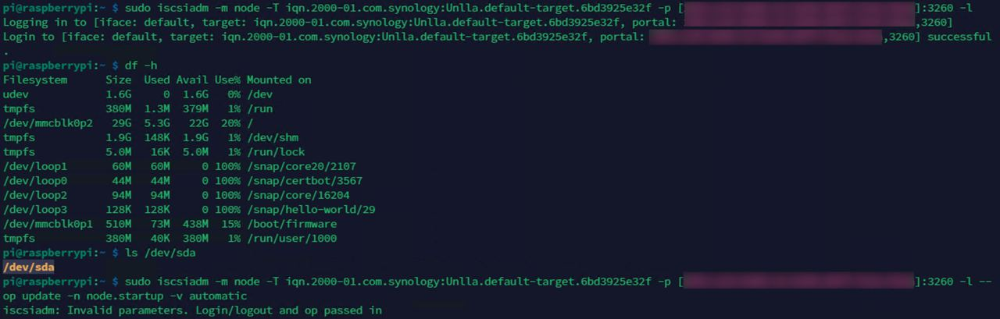
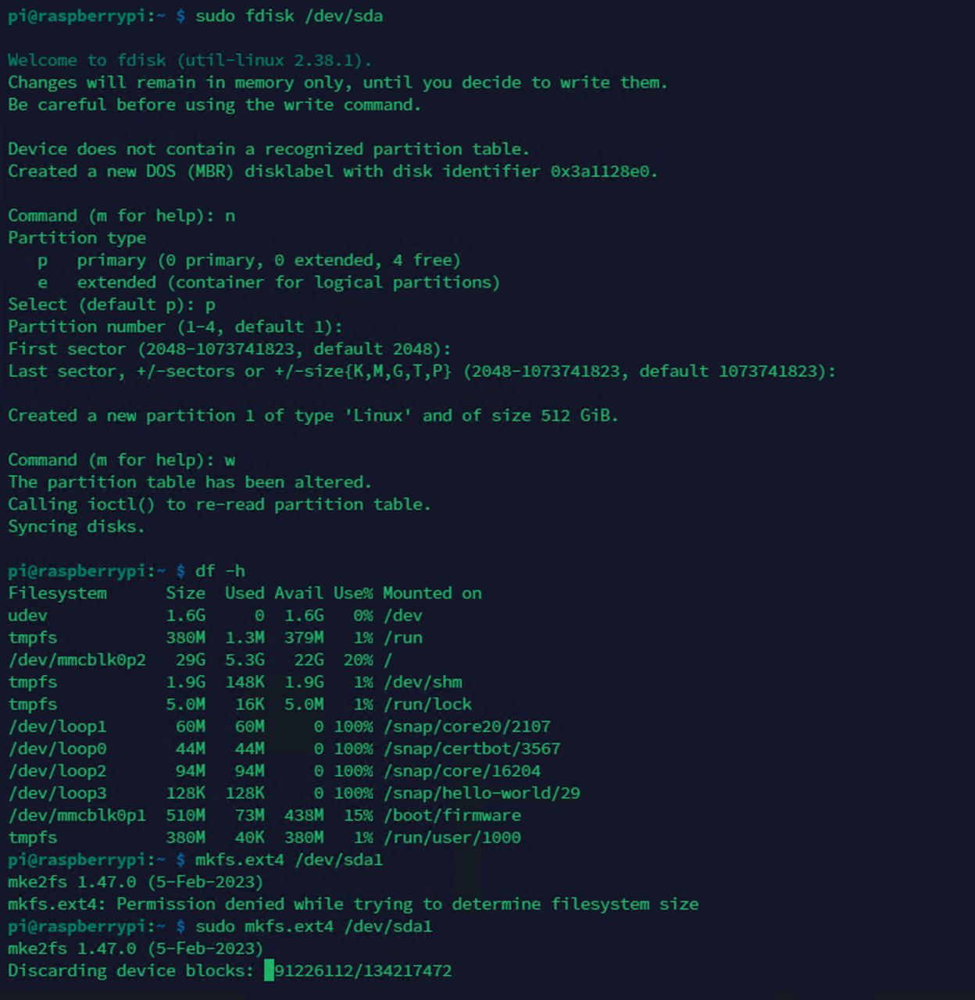
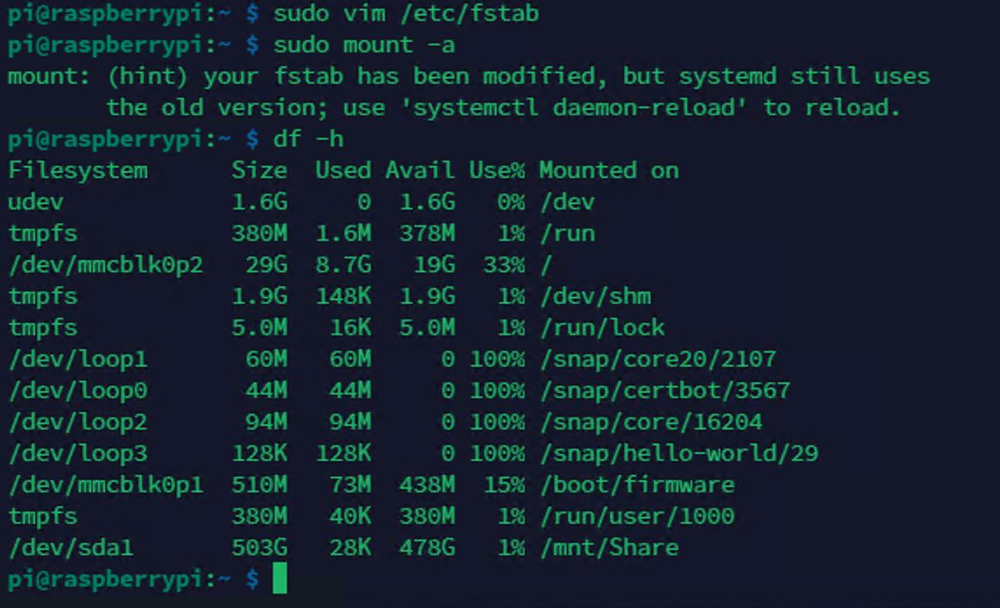

# 出事了阿北

## Concept Development
利用樹莓派建立一個 NAS，只要偵測到有人下載東西就會發出奇怪的聲音，絕對是你想要惡整朋友的絕佳選擇！ 

注意：此專案只是課程報告，如果因此破壞你們的友情，概不負責 (⊙ω⊙)

## Implementation Resources
- 硬體
    - Raspberry Pi 4
    - 16 GB SD card
- 軟體
    - docker

## Existing Library/Software
- Tailscale
- docker

## Implementation Process

## Knowledge from Lecture
- Web server (Nginx)
- Raspberry Pi 

## Installation
**以下環境皆為 Linux**
- 在 SD 卡灌入樹莓派系統
- 設定 WiFi 以及 SSH 
    - Wifi：　`sudo raspi-config` -> `System Options` -> `Wireless LAN`
    - SSH： `Interface Options` -> `SSH` -> 選擇 Yes
- 安裝 docker 以及 docker-compose
    - 由於本次使用 Pi 4，因此安裝參考官方文件，選擇 Debian 環境
    - 詳細安裝指令請參考[官方網站](https://docs.docker.com/engine/install/debian/)
- 安裝 Nginx
    -  `sudo apt install nginx`
- ISCSI 卸載硬碟
    - 
- 格式化新掛上去的硬碟
    - 
- 掛載硬碟
    - 

## Usage

## Job Assignment
- 樹莓派前期設定
    - 108321065 成祉彥
- docker、 docker-compose 安裝
    - 110213076 鄭鈺曄
- Web server、Tailscale
    - 109213069 梁心瑜
    - 110213027 簡齊君
- 奇奇怪怪的功能發想與設定
    - 110213047 楊昀潼
    - 110213027 簡齊君

## References
- [Docker installation](https://docs.docker.com/engine/install/debian/)
