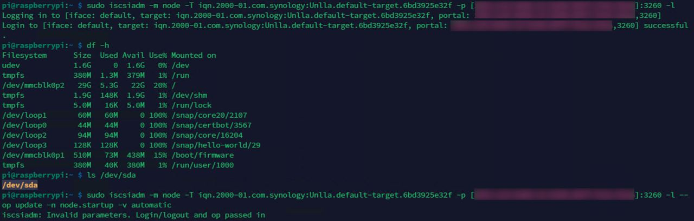
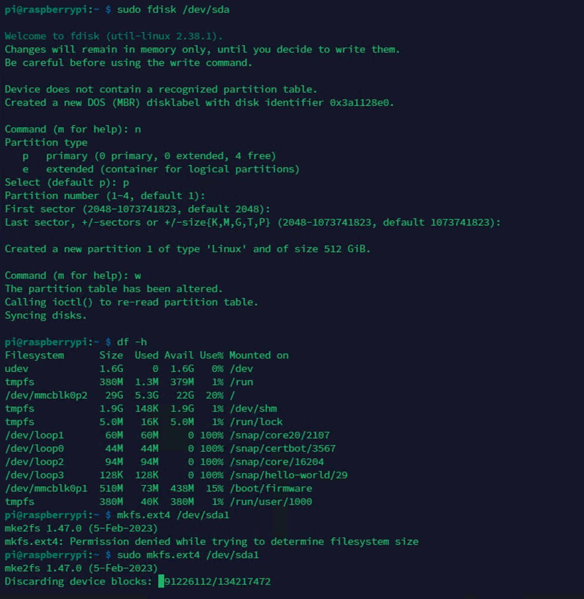
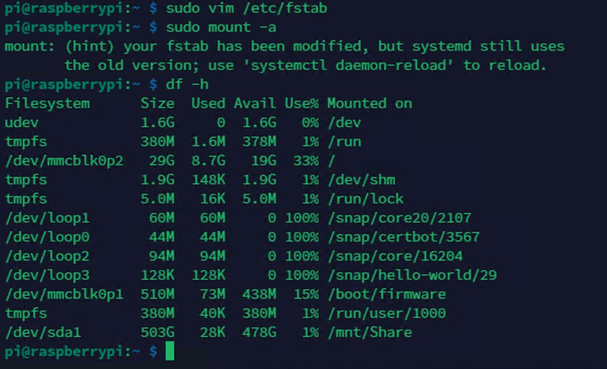

# 雲端省錢小幫手

## Concept Development
GDSC 社團需要有一個地方來存拍的照片，所以我們利用樹莓派建立一個 NAS，來放超級多的照片，這樣就能省下每個月的 Google One 的錢。

## Implementation Resources
- 硬體
    - Raspberry Pi 4
    - 16 GB SD card
    - VM (Jump Server)
    - NAS
    - Tailscale
- 軟體
    - Docker
    - NGINX
    - ISCSI

## Existing Library/Software
- Docker 
- NGINX
  - 如果嫌麻煩，可以用 [LNMP 一鍵安裝包](https://lnmp.org/install.html)
- ISCSI

## Implementation Process

## Knowledge from Lecture
- Web server (Nginx)
- Raspberry Pi 

## Installation
**以下環境皆為 Linux**
- 在 SD 卡灌入樹莓派系統
- 設定 WiFi 以及 SSH 
  - Wifi：　`sudo raspi-config` -> `System Options` -> `Wireless LAN`
  - SSH： `Interface Options` -> `SSH` -> 選擇 Yes
### 安裝 docker 以及 docker-compose

- 由於本次使用 Pi 4，因此安裝參考官方文件，選擇 Debian 環境
- 詳細安裝指令請參考 [官方網站](https://docs.docker.com/engine/install/debian/)

### 安裝軟體

- 安裝 NGINX
  - **apt 安裝**
    - `sudo apt install nginx`
  - **LNMP 一鍵安裝包**
    - `wget https://soft.lnmp.com/lnmp/lnmp2.0.tar.gz -O lnmp2.0.tar.gz && tar zxf lnmp2.0.tar.gz && cd lnmp2.0 && ./install.sh lnmp`
      - 詳細安裝過程請參考 [官方網站](https://lnmp.org/install.html)

- 安裝 iscsi
    - `sudo apt isntall open-iscsi`
- 安裝 tailscale
    - `curl -fsSL https://tailscale.com/install.sh | sh`

### 設定 Tailscale

- `sudo tailscale up` 啟動 tailscale

### ISCSI 掛載硬碟

- `sudo iscsiadm -m discovery -t sendtargets -p IP:3260` 查找 ISCSI 硬碟
- `sudo iscsiadm -m node -T iqn.2001-04.com.example:storage.disk2.sys1.xyz -p IP:3260 -l` 掛載硬碟
- `sudo fdisk -l` 查看掛載的硬碟

- `sudo mkfs.ext4 /dev/sda1` 格式化硬碟

    
- 掛載硬碟
    - `sudo mkdir /mnt/Share` 建立掛載點
    - `sudo mount /dev/sda1 /mnt/Share` 掛載硬碟
    - `sudo chmod 777 /mnt/Share` 設定權限
    - `sudo nano /etc/fstab` 設定開機自動掛載
    
    - 

## Usage

### Tailscale

- `sudo tailscale up` 啟動 tailscale
  - 跟隨指示登入
- `sudo tailscale status` 查看狀態 

### Docker
#### 修改 Docker volume 默認位置
1. `sudo nano /etc/docker/daemon.json` 修改 docker volume 默認位置
   -  `{"data-root": "/mnt/Share/docker"}` 設定 docker volume 默認位置為 /mnt/Share/docker
2. `sudo systemctl restart docker` 重啟 docker

#### 修改 docker-compose.yml

1. `mkdir seafile` 建立 seafile 資料夾
2. `cd seafile` 進入 seafile 資料夾
3. `wget https://raw.githubusercontent.com/ggogel/seafile-containerized/master/docker-compose.yml` 下載 docker-compose.yml
4. `vim docker-compose.yml` 修改 docker-compose.yml
   1. 修改 Port
        - `80:80` -> `8080:80`
        - `443:443` -> `8443:443`
5. `docker-compose up -d` 啟動 docker-compose

### Web server
#### 修改 nginx.conf（適用於 apt 安裝的 NGINX）

- `sudo nano /etc/nginx/sites-available/default` 設定 nginx
  - 將 nginx.conf 複製到 `/etc/nginx/sites-available/default`
- `sudo systemctl restart nginx` 重啟 nginx
- `sudo systemctl status nginx` 查看 nginx 狀態

#### 執行 LNMP 指令
- `sudo lnmp vhost add` 建立虛擬主機

## Job Assignment
- 樹莓派前期設定
    - 108321065 成祉彥
- docker、 docker-compose 安裝
    - 110213076 鄭鈺曄
- Web server
    - 109213069 梁心瑜
    - 110213027 簡齊君
- 奇奇怪怪的功能發想與設定
    - 110213047 楊昀潼
    - 110213027 簡齊君

## References
- [Docker installation](https://docs.docker.com/engine/install/debian/)
- [Seafile Docker image](https://github.com/ggogel/seafile-containerized)
- [ISCSI](https://www.howtoforge.com/tutorial/how-to-setup-iscsi-storage-server-on-ubuntu-2004/)
