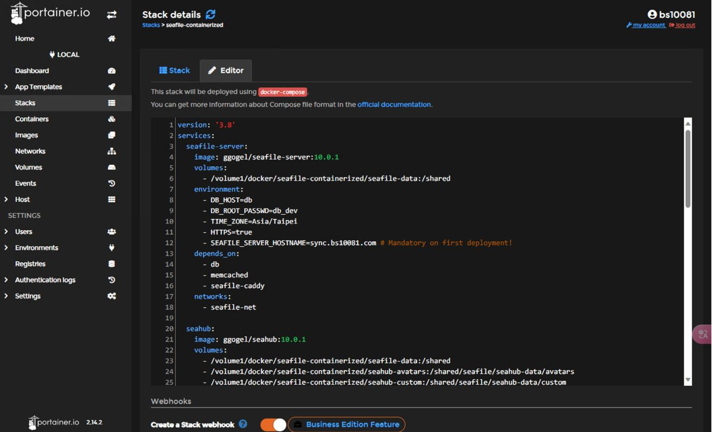

# 雲端省錢小幫手

## Concept Development
GDSC 社團需要有一個地方來存拍的照片，所以我們利用樹莓派建立一個 NAS，來放超級多的照片，這樣就能省下每個月的 Google One 的錢。

## Implementation Resources
- 硬體
    - Raspberry Pi 4
    - 16 GB SD card
    - 計中免費的 VM
    - 一臺放在實驗室的 NAS
- 軟體
    - Docker
    - NGINX
    - ISCSI

## Existing Library/Software
- Docker 
- NGINX
- ISCSI

## Implementation Process

## Knowledge from Lecture
- Web server (Nginx)
- Raspberry Pi 

## Installation
**以下環境皆為 Linux**
- 在 SD 卡灌入樹莓派系統
- 設定 WiFi 以及 SSH 
    - Wifi：　`sudo raspi-config` -> `System Options` -> `Wireless LAN`
    - SSH： `Interface Options` -> `SSH` -> 選擇 Yes
- 安裝 docker 以及 docker-compose
    - 由於本次使用 Pi 4，因此安裝參考官方文件，選擇 Debian 環境
    - 詳細安裝指令請參考[官方網站](https://docs.docker.com/engine/install/debian/)
    - [docker image 來源](https://github.com/ggogel/seafile-containerized)
    - docker-compose 相關設定
        - 
- 安裝軟體
    -  `sudo apt install nginx open-iscsi`

- ISCSI 掛載硬碟
    - `sudo iscsiadm -m discovery -t sendtargets -p IP:3260` 查找 ISCSI 硬碟
    - `sudo iscsiadm -m node -T iqn.2001-04.com.example:storage.disk2.sys1.xyz -p IP:3260 -l` 掛載硬碟
    - `sudo fdisk -l` 查看掛載的硬碟
    - 
- 格式化新掛上去的硬碟
    - `sudo mkfs.ext4 /dev/sda1` 格式化硬碟
    - 
    
- 掛載硬碟
    - `sudo mkdir /mnt/Share` 建立掛載點
    - `sudo mount /dev/sda1 /mnt/Share` 掛載硬碟
    - `sudo chmod 777 /mnt/Share` 設定權限
    - `sudo nano /etc/fstab` 設定開機自動掛載
    
    - 

## Usage

- `docker-compose up -d` 啟動 docker-compose
- `docker-compose down` 關閉 docker-compose

## Job Assignment
- 樹莓派前期設定
    - 108321065 成祉彥
- docker、 docker-compose 安裝
    - 110213076 鄭鈺曄
- Web server
    - 109213069 梁心瑜
    - 110213027 簡齊君
- 奇奇怪怪的功能發想與設定
    - 110213047 楊昀潼
    - 110213027 簡齊君

## References
- [Docker installation](https://docs.docker.com/engine/install/debian/)
